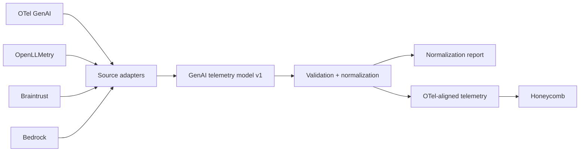
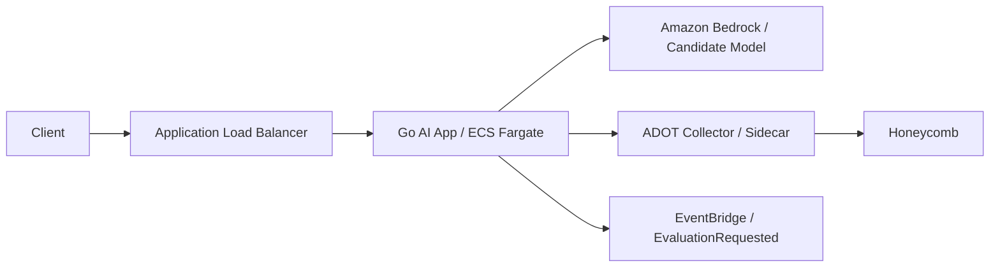
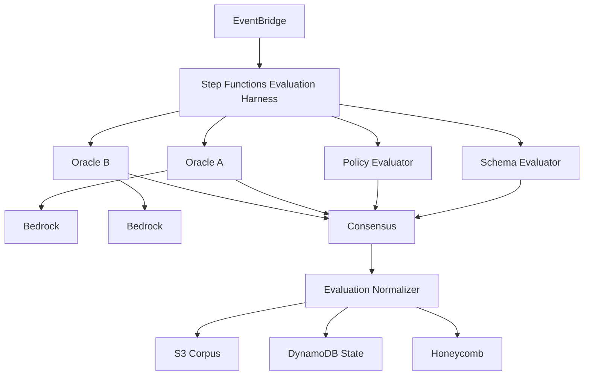
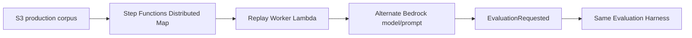

# Architecture

## 1. Telemetry normalization plane

The normalization plane is the foundation of the system. Source adapters convert known provider/framework shapes into a versioned GenAI telemetry model. Validation then distinguishes mappings that are safe from observations that are ambiguous or internally inconsistent.



The deployed ECS service exposes this as `POST /normalize`. Normalized attributes and warning/error counts are emitted as an OpenTelemetry span through the ADOT sidecar.

## 2. Production request plane



The user-facing request does not wait for evaluation. It calls the candidate model, records production telemetry, publishes an evaluation event, and returns.

## 3. Evaluation plane



The two oracle results remain separate. Consensus computes aggregate statistics and disagreement; it does not assert that the ensemble is ground truth.

## 4. Evaluation representation

```json
{
  "name": "groundedness",
  "kind": "probability",
  "value": 0.91,
  "confidence": 0.86,
  "evaluator": {
    "type": "llm_judge",
    "provider": "aws.bedrock",
    "model": "...",
    "version": "oracle-a"
  },
  "semantics": {
    "concept": "groundedness",
    "scale_min": 0,
    "scale_max": 1,
    "higher_is_better": true,
    "unit": "probability"
  }
}
```

The telemetry normalizer follows the same rule: a numerical value is not made comparable across sources unless the mapping establishes compatible semantics.

## 5. Persistence

```text
evaluations/<trace-id>.json         # normalized evaluation output
corpus/production/<trace-id>.json   # replay input corpus
replay-runs/...                     # Distributed Map result writer output
```

DynamoDB stores operational evaluation state. Honeycomb remains the analytical observability surface.

## 6. Counterfactual replay



Replay outputs carry `replay.of_trace_id` and are deliberately excluded from `corpus/production/`, preventing replay-generated cases from recursively expanding the replay corpus.

## 7. Failure philosophy

The system prefers an explicit warning/error over a silent semantic guess. Examples include unknown evaluation-score semantics, incompatible token accounting, missing required canonical fields, and version-specific schema drift.
